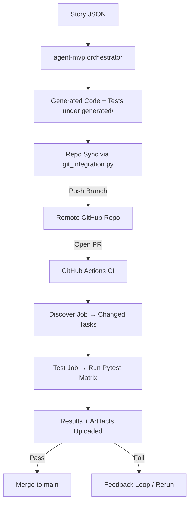

Perfect — here’s your **canonical high-level architecture doc in Markdown**. It’s structured for clarity, version-controllable, and suitable as a single reference file in your repo.

---

# Automated Code Generation & Testing Pipeline – Architecture

## 1. System Overview

This system automates the lifecycle of **story-driven code generation, testing, and CI validation**.

- **Generator**: `agent-mvp` orchestrates code + test creation.
- **Repo Sync**: Generated artifacts stored in a GitHub clone (`autoGenCode`), then pushed upstream.
- **CI/CD**: GitHub Actions (`agent-ci.yml`) runs task-specific tests on PRs.

**Goal**: Ensure every generated task is reproducible, testable, and automatically merged into `main` after validation.

---

## 2. Data & Process Flow

---

## 3. Repository & Branch Strategy

- **`main`** → canonical, tested code.
- **Feature branches**:

  - `"story/storyXXX"` (per story).
  - `"task/<taskId>"` (per task).

- **Branch hygiene**:

  - Old task dirs removed before writing new ones (`git rm` + `shutil.rmtree`).
  - Reset strategy (`git fetch + reset --hard`) avoids non-fast-forward errors.
  - Auto-delete feature branches after merge (future step).

---

## 4. Task Lifecycle

1. **Story Ingestion**

   - Full JSON read from `meta/stories/*.json`.
   - Persisted into `generated/<taskId>/meta/story.json` (audit trail).
   - `story_ref.json` created for linkage.

2. **Design Prompt**

   - (Next step) Ensure **full story** included in design prompt, not just test stage.

3. **Code Generation**

   - Written under `generated/<taskId>/src`.

4. **Test Generation**

   - `test_story.py` created via OpenAI.
   - Structured pytest tests with parametrization safeguards.

5. **Repo Integration**

   - Feature branch created.
   - Task folder replaced in repo.
   - Commit + push.
   - PR opened against `main`.

6. **CI Validation**

   - Discover job finds changed `<taskId>` dirs.
   - Matrix test job runs per task with optional limits (`max-tests`).
   - Results uploaded in JUnit XML.

---

## 5. GitHub Actions Workflow (`agent-ci.yml`)

**Triggers**:

- PRs to `main` touching `generated/**` or workflow file.
- Manual runs (`workflow_dispatch`) with optional inputs.

**Jobs**:

- **Discover**:

  - Detect changed tasks or use manual input.
  - Output matrix of taskIds.

- **Test** (matrix):

  - Install global + per-task dependencies.
  - Run N tests (`max-tests`) or full suite.
  - Upload `ci-results.xml`.

---

## 6. Error Handling & Recovery

- **Non-fast-forward push** → `git fetch + reset --hard`.
- **Stale files** → `git rm -r <taskId>` before writing.
- **Empty task matrix** → skip gracefully.
- **Pytest parametrize bug** → precompute strings outside f-strings.

---

## 7. Evolution Roadmap

- ✅ Current: Stable generation + CI validation loop.
- 🔜 Planned Improvements:

  - Full story included at **design prompt stage**.
  - Policy for multiple reruns of same story (overwrite vs append).
  - Auto-clean merged feature branches.
  - Feedback loop: failed CI triggers re-generation with context.

---

## 8. Summary

This architecture ensures:

- **Auditability**: Stories + generated code preserved.
- **Reproducibility**: CI validates changes per task.
- **Scalability**: Matrix testing supports many tasks in parallel.
- **Maintainability**: Branch hygiene + cleanup strategies.

---

✅ This document should live at the root of your repo (`ARCHITECTURE.md`) as the canonical reference.
flowchart LR
A[[Triggers]] -->|pull_request to main (paths: generated/\*\*, .github/workflows/agent-ci.yml)| B[Discover Job]
A -->|workflow_dispatch (inputs: task, max-tests)| B

subgraph Discover
B --> C{Determine Task Set}
C -->|PR diff| D[Collect changed generated/<taskId> dirs]
C -->|Manual input| E[Parse comma-separated taskIds]
D --> F[Normalize + De-duplicate]
E --> F
F --> G{Any tasks?}
end

G -- "No" --> H[Set empty matrix; short-circuit test job]
G -- "Yes" --> I[Emit matrix: tasks=<taskId list>]

subgraph Test (matrix over tasks)
direction LR
I --> J[Checkout repo]
J --> K[Setup Python]
K --> L[Install global deps]
L --> M[Install per-task deps (if any)]
M --> N[Select tests: all or top N (max-tests)]
N --> O[Run pytest for current <taskId>]
O --> P[Generate ci-results.xml]
P --> Q[Upload JUnit artifact]
end

Q --> R{All matrix jobs passed?}
R -- "Yes" --> S[PR ready to merge]
R -- "No" --> T[Fail workflow; surface artifacts]
